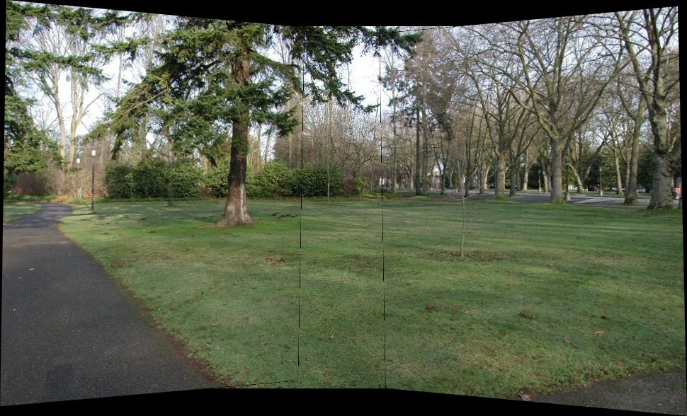
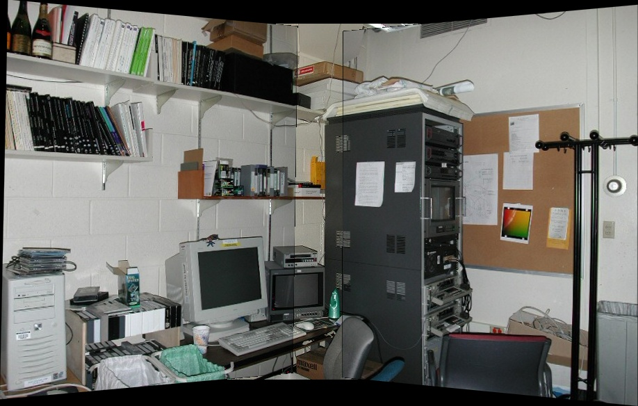
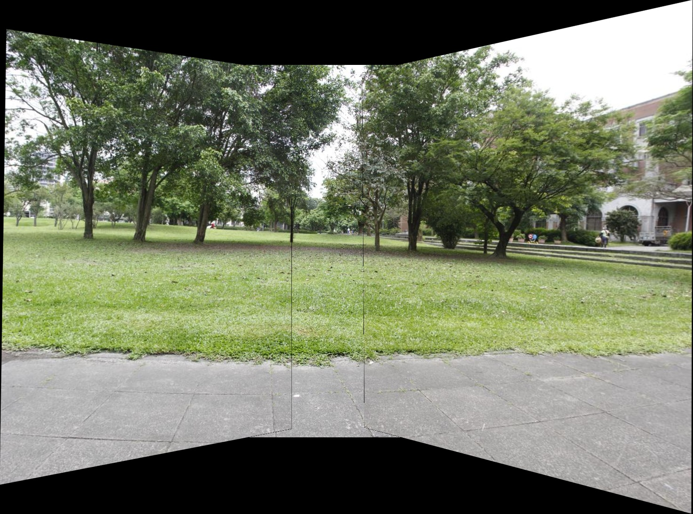
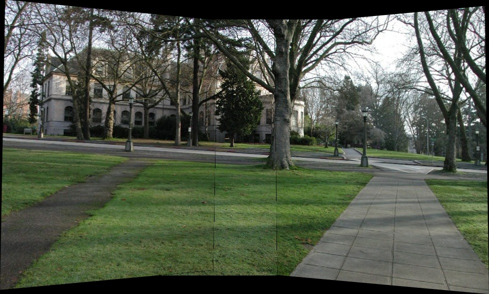

# Image Stitcher

This is a Python-based image stitching application using OpenCV's SIFT feature matching and then constructing the Homography matrices usign the RANSAC method.

## Demo Images

<p align="center">
  <table>
    <tr>
      <td></td>
      <td></td>
    </tr>
    <tr>
      <td></td>
      <td></td>
    </tr>
  </table>
</p>

## Installation

1. **Clone this repository**:

   ```bash
   git clone https://github.com/yourusername/image-stitcher.git
   cd image-stitcher
   ```

2. **Build the Docker image**:

   ```bash
   cd cli_tool
   docker build -t image-stitcher .
   ```

3. **Run the application using Docker**.

   You can either provide a folder of images or individual image files as input.

## Usage

### From the Command Line

You can run the image stitcher via Docker in two ways:

#### Option 1: Provide a folder containing images

If you want to stitch images from a folder, run:

```bash
sudo docker run --rm -v $(pwd):/data image-stitcher -m 100 -f /data/test1 -o /data/output.jpg
```

#### Option 2: Provide individual image file paths

If you have specific images to stitch, run:

```bash
sudo docker run --rm -v $(pwd):/data image-stitcher -i /data/test1/image1.jpg /data/test1/image2.jpg -o /data/output.jpg
```

### Arguments

- `-i, --images`: Provide one or more image paths to stitch.
- `-f, --folder`: Provide the path to a folder containing the images to stitch.
- `-o, --output`: Provide the output file path where the stitched image will be saved.
- `-m, --min_matches`: Minimum number of matches required to stitch images. Default is 100.

## Approach:

1. **Feature Detection**: Used SIFT to detect keypoints and compute descriptors for each image.

2. **Feature Matching**: Matched features by taking the closest two matches based on L2 distance. Used Lowe's ratio test to filter out false matches.

3. **Homography Estimation**: Used RANSAC to estimate the homography matrix between the images based on the matched keypoints.

4. **Constructing Canvas**: Calculated the size of the canvas by getting the extreme heights and widths based on the homography matrix by transforming the corners of the image.

5. **Image Stitching**: Used the homography matrix to warp and stitch the images together.

**Note:** This is a basic tool it does not support any additional features.
